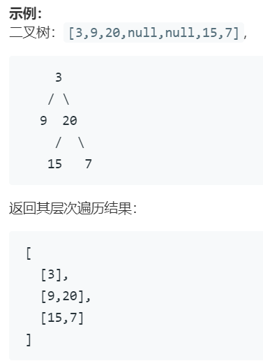
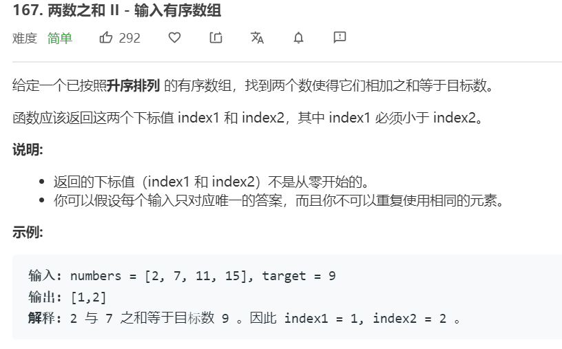
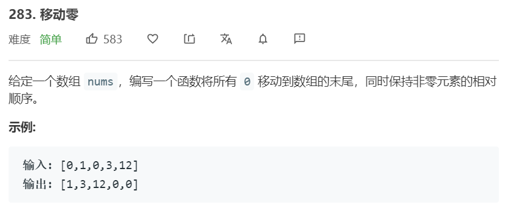
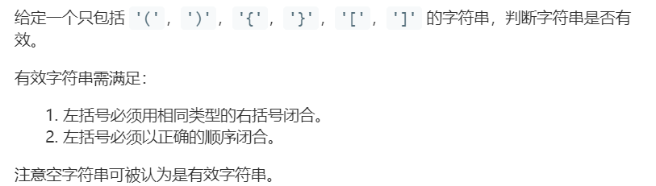
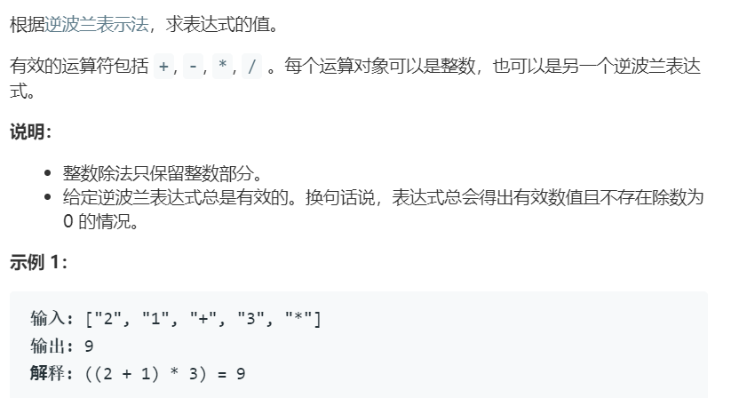

# leetcode 做题笔记——简洁版(复习用)

# 树类问题

## 102题 二叉树的层序遍历

层序遍历首先会想到使用queue，但是这还是不够的，每一层的结果都被保存到一个list中。
**设计len**来保存当前层级的节点个数，**计数count**进行记录，一旦count==len 则将layer数组添加到答案中，并清空数组，重置count与len，直到队列为空。

相关练习 
[107.二叉树的层次遍历 II](https://leetcode-cn.com/problems/binary-tree-level-order-traversal-ii/)&nbsp;&nbsp;&nbsp;
[103.二叉树的锯齿形层次遍历](https://leetcode-cn.com/problems/binary-tree-zigzag-level-order-traversal/)&nbsp;&nbsp;&nbsp;
[199. 二叉树的右视图](https://leetcode-cn.com/problems/binary-tree-right-side-view/)

# 数组问题

*对撞指针技巧*

## 167题 两数之和 II - 输入有序数组

解法一

设定两个指针i,j，一个在头，一个在尾。 
如果nums[i]+nums[j]>target时,j--;  
如果nums[i]+nums[j]<target时,i++;  
由于题目规定不能取两个相同的数，所以我们要保证i<j 即循环条件为while(i<j)

解法二

只使用一个指针与哈希表，哈希表的key是nums的值，而value是这个值所对的索引。在指针的移动过程中寻找，当前target-nums[i]的值，是否曾经出现过。如果出现过就取出它的索引输出。如果没有将当前的nums[i]与i保存，并继续像后面寻找。

相关练习&nbsp;&nbsp;&nbsp;[344. 反转字符串](https://leetcode-cn.com/problems/reverse-string/)&nbsp;&nbsp;&nbsp;[345. 反转字符串中的元音字母](https://leetcode-cn.com/problems/reverse-vowels-of-a-string/)&nbsp;&nbsp;&nbsp;[11. 盛最多水的容器](https://leetcode-cn.com/problems/container-with-most-water/)

---

数组问题一定要 *明确指针的索引含义*

## 167题 两数之和 II - 输入有序数组

**解决这种题目的核心是一定要明确自己定义的索引的含义，即是开区间还是闭区间。** 
假设我们定义了一个指针i，我们设定[0....i)**开区间**为我们需要的部分即非零的部分。同时我们设定一个指针j从头往后遍历数组，当我们的j找到一个非零的元素时，将这个元素与i的位置互换。如果遇到零则j++不进行处理。

相关练习&nbsp;&nbsp;&nbsp;[27. 移除元素](https://leetcode-cn.com/problems/remove-element//) &nbsp;&nbsp;&nbsp;[26. 删除排序数组中的重复项](https://leetcode-cn.com/problems/remove-duplicates-from-sorted-array/)&nbsp;&nbsp;&nbsp;[80. 删除排序数组中的重复项 II](https://leetcode-cn.com/problems/remove-element//)

[75.颜色分类详解](https://wangxucheng1995.github.io/2020/05/18/%E5%B0%8F%E7%99%BD%E7%9A%84%E7%AE%97%E6%B3%95%E4%BF%AE%E7%82%BC%E4%B9%8B%E6%97%85-%E6%95%B0%E7%BB%84%E9%97%AE%E9%A2%98/)

---

# 栈 队列 优先队列

## 102题 二叉树的层序遍历

使用一个stack保存左括号类型。当取到左括号推入栈中，当取到右括号时将左括号中的值推出，如果不一样则return false。并且最后要判断栈是否为空。

*相似题目*

## 150. 逆波兰表达式求值

利用栈，把数字依次推入栈中。当遇到符号时，推出两个数进行运算。然后再推进栈。
**值得注意的是这一题的数据类型都是String**

String->Integer 使用 Integer.parseInt() 
Integer->String 使用 String.valueof()

[71. 简化路径](https://leetcode-cn.com/problems/simplify-path/)